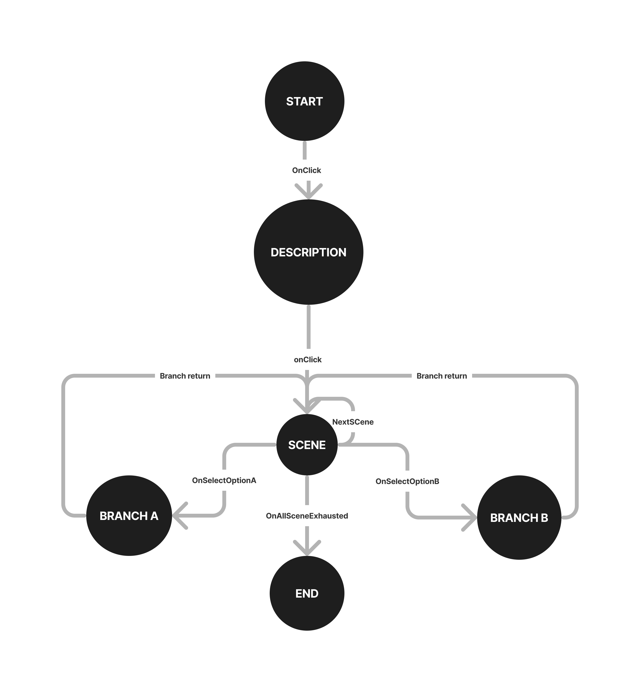
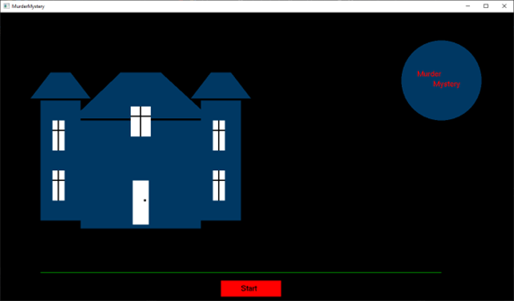
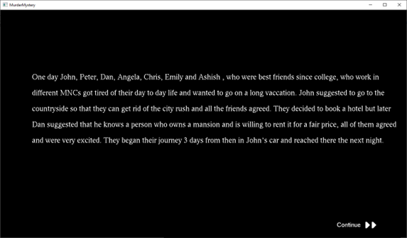
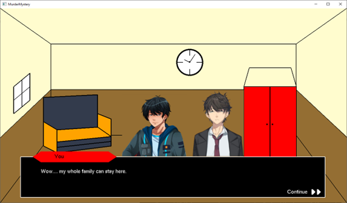
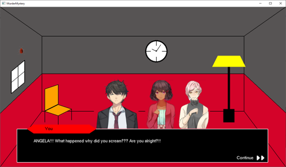
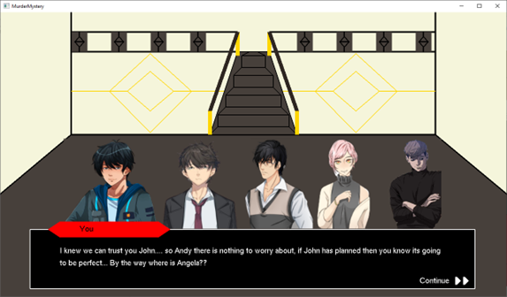
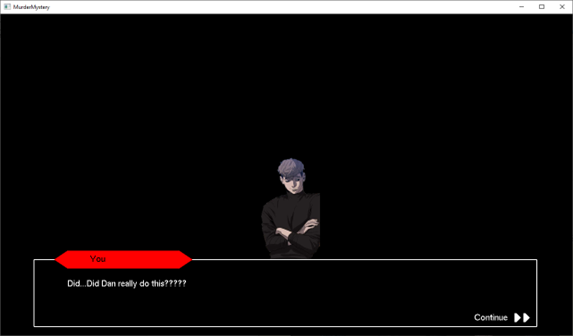
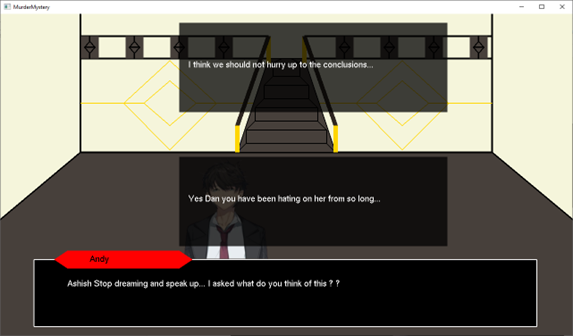
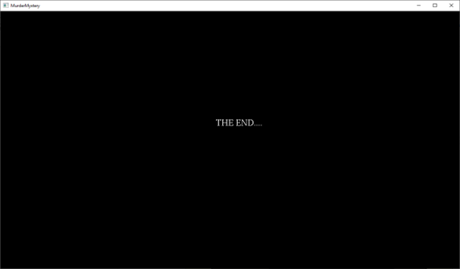

# MurderMystery
This project was part of the 6th Semester Computer Science and Engineering Mini-Project of the subject 'Computer Graphics and Visualization'.

## Description
This is a Visual Novel developed using OpenGL with GLUT API for rendering and C++ for logic related functionality. The story involves 7 friends who got tired working working at their MNC's and decided to take a vacation. But destiny had some other plans. Play the game now to know how did this joyful vacation turned into a disastrous part of their life.

## External Libraries
GLUT - OpenGL API for rendering and drawing shapes.  
STB_IMAGE - External library to process Image data into character blocks.

## State Diagram  of the Game's Story

## ScreenShots

## Launch Screen

## Description Screen

## First Room with Characters 

## Second Room with Characters

## Living Room with Characters

## Flashback Scene

## Story Branching Options

## End Screen

## Play This Game on your PC!

